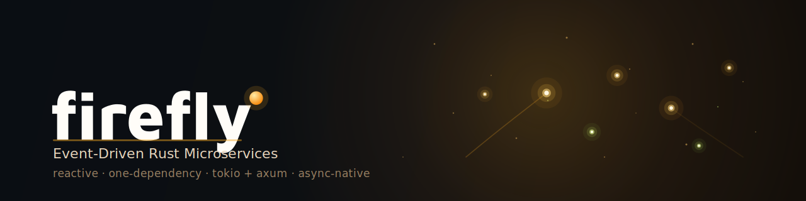
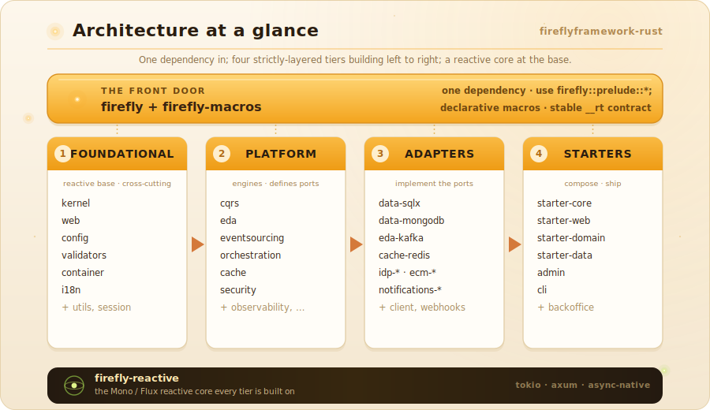

<p align="center">
  
</p>

<h1 align="center">Firefly Framework for Rust</h1>

<p align="center">
  <b>Spring Boot for Rust</b> — a production-grade platform for building
  <i>reactive</i> (WebFlux-style), event-driven, resilient microservices on
  Rust 1.88+ (<code>tokio</code> + <code>axum</code>).
</p>

<p align="center">
  <a href="LICENSE"></a>
  <a href="CHANGELOG.md"></a>
  <a href="https://www.rust-lang.org"></a>
  <a href="docs/book/src/05-reactive-model.md"></a>
  <a href="crates/firefly/README.md"></a>
  <a href="#real-infrastructure-testing"></a>
</p>

<p align="center">
  <a href="docs/book/"><b>The Book</b></a> &nbsp;·&nbsp;
  <a href="#quickstart"><b>Quickstart</b></a> &nbsp;·&nbsp;
  <a href="#feature-matrix">Features</a> &nbsp;·&nbsp;
  <a href="#architecture-at-a-glance">Architecture</a> &nbsp;·&nbsp;
  <a href="#workspace-layout">Crates</a> &nbsp;·&nbsp;
  <a href="CHANGELOG.md">Changelog</a>
</p>

> **Read the book — [Firefly Framework for Rust](docs/book/)** — the canonical,
> best-in-class guide: a punchy [Quickstart](docs/book/src/02-quickstart.md)
> (zero to a running reactive endpoint in minutes), the keystone
> [Reactive Model](docs/book/src/05-reactive-model.md) chapter (`Mono`/`Flux`),
> the new [Declarative Services with Macros](docs/book/src/21-declarative-macros.md)
> chapter, and full chapters on configuration, persistence, DDD, CQRS, EDA, event
> sourcing, sagas, HTTP clients, security, observability, testing, and
> production. Build it locally with `mdbook build docs/book` and open
> `docs/book/book/index.html`, or read the offline editions:
> [`docs/book/dist/firefly-rust-by-example.pdf`](docs/book/dist/firefly-rust-by-example.pdf)
> and [`.epub`](docs/book/dist/firefly-rust-by-example.epub).

> **Two headline wins.** (1) A **Spring-Boot-for-Rust
> developer experience**: add the one [`firefly`](crates/firefly/README.md)
> dependency, `use firefly::prelude::*;`, and declare your service with
> [`firefly-macros`](crates/macros/README.md) —
> `#[derive(Command)]`/`#[rest_controller]`/`#[command_handler]`/`#[scheduled]`
> instead of hand-rolled builder wiring. (2) **Pluggable hexagonal databases**:
> one set of [`firefly-data`](crates/data/README.md) ports, real adapters for
> **Postgres, MySQL, SQLite** ([`firefly-data-sqlx`](crates/data-sqlx/README.md))
> and **MongoDB** ([`firefly-data-mongodb`](crates/data-mongodb/README.md)) — a
> *new database is a new adapter, not a rewrite*. See
> [The two headlines](#the-two-headlines) below.

At its heart is a **WebFlux-style reactive core** — [`firefly-reactive`](crates/reactive/README.md)
gives you `Mono<T>` (0-or-1) and `Flux<T>` (0..N) over `tokio`
futures/streams, a Reactor-style reactive model built for Rust. That core
threads through the whole framework: reactive HTTP responders that stream
NDJSON/SSE with real backpressure, a `ReactiveCrudRepository` (in-memory
or real Postgres), a reactive `WebClient`, reactive EDA subscriptions,
and a reactive CQRS bus. If you have written Spring WebFlux, you already
know the shape.

Around that core, the framework provides the cross-cutting machinery
that every non-trivial business service needs — RFC 7807 error
envelopes, idempotency, correlation propagation, CQRS, event-driven
messaging, event sourcing, sagas, configuration servers, identity
adapters, document management, notifications, callbacks, webhooks —
behind a single, opinionated composition pattern. On top of that core it
ships a **full application layer**: a turnkey
[`FireflyApplication`](crates/firefly/README.md) bootstrap (the
`SpringApplication.run` analog — one line of `main`, component-scanned,
auto-mounted, self-hosting its admin dashboard and serving auto-generated
OpenAPI 3.1 + Swagger UI + ReDoc), a domain-driven kernel, an opt-in
DI container, aspect-oriented advice, server-side HTTP sessions, a
shell-style CLI framework, WebSocket server support, an admin
dashboard, a `firefly` developer CLI, and
**real, fully-wired** vendor adapters — Keycloak/Azure/Cognito IDP,
S3/Blob/e-sign ECM, SMTP/SendGrid/Resend/Twilio/Firebase notifications,
Redis/Postgres cache, and Kafka/RabbitMQ/Postgres/Redis-Streams event
transports. **No stubs remain** — every adapter drives its real
provider.

Firefly Framework is built natively in idiomatic Rust with `tokio`,
`axum`, `tower`, `serde`, `thiserror`, `async-trait`, RustCrypto, and
`tracing`. Its public contracts — the `application/problem+json` error
shape, `Idempotency-Key` semantics, event envelopes, HMAC webhook
signatures, saga step definitions — are defined as stable, versioned wire
formats so any service that speaks them interoperates cleanly.

The compiled-language core (foundational + platform + starter tiers) is
kept wire-stable across releases; the application layer is purely
additive — every extension layers onto the existing crates without
changing a single core wire format.

---

## Table of Contents

- [The two headlines](#the-two-headlines)
- [Why Rust](#why-rust)
- [Feature matrix](#feature-matrix)
- [Architecture at a glance](#architecture-at-a-glance)
- [Workspace layout](#workspace-layout)
- [Quickstart](#quickstart)
- [Build, test, ship](#build-test-ship)
- [Real-infrastructure testing](#real-infrastructure-testing)
- [Status](#status)
- [Documentation](#documentation)
- [License &amp; contributing](#license--contributing)

---

## The two headlines

### 1 · Spring-Boot-for-Rust ergonomics — one dependency, declarative macros

Before, a service listed ten-to-fifteen `firefly-*` crates and wired
everything by hand. Now there is the [`firefly`](crates/firefly/README.md)
**facade crate**: add one dependency, glob-import one prelude, and the whole
framework — CQRS, the DI container, the reactive web stack, scheduling,
orchestration — is in scope, alongside every macro from
[`firefly-macros`](crates/macros/README.md):

```toml
[dependencies]
firefly = "26.6.21"            # the whole framework + every macro
axum    = "0.7"               # you author axum handlers
serde   = { version = "1", features = ["derive"] }
tokio   = { version = "1", features = ["rt-multi-thread", "macros"] }
```

The macros (`#[derive(Command)]` / `#[derive(Query)]` / `#[derive(Component)]`
/ `#[derive(DomainEvent)]` / `#[derive(AggregateRoot)]`, `#[command_handler]` /
`#[query_handler]`, `#[scheduled]`, `#[rest_controller]` + `#[get/post/put/delete/patch]`,
`#[event_listener]`) collapse the framework's builder wiring into declarations
that sit next to the code they describe:

```rust,ignore
use firefly::prelude::*;
use serde::Serialize;

// A command + its handler — `register_place_order(bus)` is generated.
#[derive(Clone, Serialize, Command)]
pub struct PlaceOrder {
    #[firefly(validate)] pub customer: String,
    #[firefly(validate)] pub sku: String,
}

#[command_handler]
pub async fn place_order(cmd: PlaceOrder) -> Result<OrderView, CqrsError> { /* … */ }

// An axum controller — `OrderApi::routes(state) -> axum::Router` is generated.
#[rest_controller(path = "/api/v1/orders")]
impl OrderApi {
    #[post("")]    async fn create(/* … */) -> WebResult<Json<OrderView>> { /* … */ }
    #[get("/:id")] async fn fetch(/* … */)  -> WebResult<Json<OrderView>> { /* … */ }
}
```

The macro-generated code references runtime types through the facade's hidden
`__rt` contract path, so a service that depends only on `firefly` (plus the
`axum`/`serde` it writes against anyway) compiles whatever a macro expands to —
without ever listing the underlying `firefly-*` crates. The new
[`samples/macro-quickstart`](samples/macro-quickstart) re-implements the
[`orders`](samples/orders) sample this way: the same behaviour — plus reactive `Mono`/`Flux` endpoints — in **415 source
lines instead of 1022**, **2 modules instead of 7**, no hand-written
`impl Message`, `bus.register(…)`, `Router::new().route(…)`, or scheduler
builder. See the
[Declarative Services with Macros](docs/book/src/21-declarative-macros.md)
chapter.

### 2 · Pluggable hexagonal databases — a new DB is a new adapter

[`firefly-data`](crates/data/README.md) defines the storage-agnostic ports —
the `Filter` DSL, the composable `Specification`, the `Repository` /
`ReactiveCrudRepository` / `ReactiveSpecificationRepository` traits, plus
auditing and soft-delete. Firefly makes the data layer *truly hexagonal*: a
`SqlDialect` abstraction (`PostgresDialect` / `MySqlDialect` / `SqliteDialect`)
renders the same query tree for any relational backend, and
`Specification::to_mongo()` lowers it to a MongoDB `$`-operator filter. Two new
adapter crates implement the **same ports**:

| Adapter crate | Backends | Behind the ports |
|---------------|----------|------------------|
| [`firefly-data-sqlx`](crates/data-sqlx/README.md) | **Postgres + MySQL + SQLite** (over `sqlx`) | `SqlxRepository` / `SqlxReactiveRepository` — picks the right `SqlDialect` from the pool at runtime; streams reads as a `Flux<T>` |
| [`firefly-data-mongodb`](crates/data-mongodb/README.md) | **MongoDB** (official `mongodb` crate) | `MongoRepository<T, ID>` — the same `Specification` lowered via `Specification::to_mongo()` |

Both auto-apply auditing (`created_at`/`updated_at`/`created_by`/`updated_by`)
and soft-delete (hidden-on-read, logical delete). A service codes once against
the `firefly-data` ports and swaps Postgres for MySQL, SQLite, or MongoDB by
swapping the adapter — *no call-site changes*. All four backends are exercised
against **real** Postgres/MySQL/SQLite/MongoDB. See the
[Persistence](docs/book/src/07-persistence.md) chapter.

---

## Why Rust

Modern back-office systems aren't bottlenecked by writing the next
handler. They're bottlenecked by getting **the same** handler,
**the same** error response, **the same** correlation id, **the same**
saga compensation, **the same** observability story across every service
in the platform. Every team that re-invents these picks slightly
different conventions and the platform fragments.

Firefly Framework treats those concerns as solved problems on Rust too:

- **Reactive by design.** `firefly-reactive` provides a Reactor-style
  `Mono` / `Flux` model for Rust: lazy, composable, `FireflyError`-typed publishers that
  drop straight into an axum handler. A handler can return a `Mono<T>`
  (rendered as JSON, with `Ok(None)` → 404) or a `Flux<T>` (streamed as
  `application/x-ndjson` or SSE with **true backpressure** — a million
  rows never land in memory). The same two types back the repositories,
  the `WebClient`, EDA subscriptions, and the CQRS bus.
- **Composed, not constructed.** A single
  `FireflyApplication::new("orders").run().await` — the
  `SpringApplication.run` analog — is the whole `main`. It component-scans
  the DI container, auto-mounts every `#[rest_controller]`, drains the
  discovered CQRS handlers / EDA listeners / `#[scheduled]` tasks,
  auto-discovers security, wires the whole infrastructure tier (middleware
  chain, cache, CQRS bus, event broker, health composite, metrics,
  scheduler, lifecycle), self-hosts the admin dashboard, serves
  auto-generated OpenAPI docs, prints a line-by-line startup report, and
  serves the public + management ports with graceful shutdown. Authors
  write commands, queries, handlers, and controllers — nothing more.
- **Stable wire contracts.** The wire contract, the
  `application/problem+json` shape, the `Idempotency-Key` semantics, the
  saga step definitions, the event envelopes, the HMAC webhook
  signatures — all versioned, standards-based, and stable across releases.
- **Pluggable at the adapter layer.** Each integration point (IDP, ECM,
  storage, e-signature, notification channel, message broker) is an
  `async_trait` object-safe port with multiple adapter implementations
  selected at wiring time (`Arc<dyn Adapter>`).
- **Observable by default.** `tracing` structured logging with
  correlation-id enrichment, actuator health/metrics endpoints,
  RFC 7807 error envelopes, and a startup banner that names the
  application, version and runtime are all on out of the box.
- **Real adapters, no stubs.** Every infrastructure adapter ships fully
  wired: `firefly-cache-redis` speaks RESP and `firefly-cache-postgres`
  speaks SQL, `firefly-eda-{kafka,rabbitmq,postgres,redis}` drive
  `rdkafka` / `lapin` / `tokio-postgres` / Redis Streams,
  `firefly-notifications-smtp` delivers MIME over `lettre`, and every
  IDP / ECM / notification vendor adapter — Keycloak, Azure AD, Cognito,
  S3, Azure Blob, DocuSign, Adobe Sign, Logalty, SendGrid, Resend,
  Twilio, Firebase — calls its real provider over `reqwest`. There are
  no `NotImplemented` sentinels left in the adapter tier. See
  [`MODULES.md`](MODULES.md) for the per-crate catalogue.

---

## Feature matrix

| Capability | Crate(s) | Spring / Reactor analog | Status |
|------------|----------|-------------------------|:------:|
| **One-dependency facade + prelude** | `firefly` | `spring-boot-starter` | Full |
| **Turnkey bootstrap** (`FireflyApplication::new("orders").run().await` — one-line `main`: component-scan, auto-mount controllers, drain handlers/listeners/scheduled, self-host admin, originate W3C trace context, startup report, public + management ports with graceful shutdown) | `firefly` | `SpringApplication.run` | Full |
| **Auto-generated OpenAPI 3.1** (`/v3/api-docs` + `/openapi.json` spec, Swagger UI at `/swagger-ui`, ReDoc at `/redoc`, `#[derive(Schema)]` DTO models — auto-wired, no app code) | `firefly-openapi`, `firefly-macros` | springdoc-openapi | Full |
| **Declarative macros** (`#[derive(Command)]`, `#[rest_controller]`, `#[command_handler]`, `#[scheduled]`, …) | `firefly-macros` | Spring annotations | Full |
| **Declarative AOP aspects** (`#[aspect(pointcut, order)]` + `#[before]`/`#[after]`/`#[after_returning]`/`#[after_throwing]`/`#[around]`, woven at the explicit `advised(…)` call site) | `firefly-aop`, `firefly-macros` | Spring `@Aspect` / AspectJ advice | Full |
| **Declarative caching** (`#[cacheable]` / `#[cache_put]` / `#[cache_evict(all_entries)]` over `async fn -> Result<V, E>`) | `firefly-macros`, `firefly-cache` | Spring `@Cacheable` / `@CachePut` / `@CacheEvict` | Full |
| **Bean validation** (`#[derive(Validate)]` constraints `email`/`url`/`not_empty`/`length`/`range`/`pattern`/`custom` + the `Valid<T>` extractor: 422 on a constraint failure, 400 on malformed JSON) | `firefly-validators`, `firefly-web` | JSR-380 Bean Validation + `@Valid` | Full |
| **Async methods** (`#[async_method]` on `async fn(self: Arc<Self>, …) -> R` → `TaskHandle<R>`) | `firefly-macros`, `firefly-scheduling` | Spring `@Async` | Full |
| **Reactive core (`Mono` / `Flux`)** | `firefly-reactive` | Project Reactor | Full |
| **Reactive HTTP responders** (NDJSON / SSE streaming, backpressure) | `firefly-web` | WebFlux `@RestController` returning `Mono`/`Flux` | Full |
| **Pluggable hexagonal databases** (Postgres / MySQL / SQLite / MongoDB) | `firefly-data`, `-data-sqlx`, `-data-mongodb` | Spring Data ports + adapters | Full |
| **Reactive repositories** (in-memory + real Postgres + sqlx + Mongo) | `firefly-data`, `-data-sqlx`, `-data-mongodb` | R2DBC `ReactiveCrudRepository` | Full |
| **Reactive HTTP client** (`WebClient`, `body_to_mono`/`body_to_flux`) | `firefly-client` | WebFlux `WebClient` | Full |
| **Reactive CQRS bus** (`send_mono` / `query_mono`) | `firefly-cqrs` | Axon / reactive command bus | Full |
| **Reactive EDA** (`subscribe_reactive` → `Flux<Event>`) | `firefly-eda` | reactive Kafka/AMQP listener | Full |
| **In-process application events** (`publish_event`, `#[application_event_listener]`, `#[transactional_event_listener(phase=…)]`, `LocalTransactionManager`) | `firefly-transactional` | Spring `@EventListener` / `@TransactionalEventListener` | Full |
| **EDA after-commit externalization** (`externalize_after_commit::<E>`, `register_broker`/`publish_to_broker` — committed tx publishes to the broker, rolled-back does not) | `firefly-eda`, `firefly-transactional` | Spring Modulith `@Externalized` | Full |
| RFC 7807 errors, correlation, idempotency, PII masking | `firefly-web`, `firefly-kernel` | `@ControllerAdvice` ProblemDetail | Full |
| Typed config (YAML + env + flags + profiles, `${...}`, refresh) | `firefly-config` | `@ConfigurationProperties` | Full |
| Event sourcing (aggregates, snapshots, projections, outbox, tenancy) | `firefly-eventsourcing` | Axon | Full |
| Sagas / Workflows (DAG) / TCC, compensation, retry | `firefly-orchestration` | Temporal / Camunda | Full |
| Security (JWT, JWKS, RBAC, OAuth2 login + authorization server, CSRF) | `firefly-security` | Spring Security | Full |
| Actuator (`health`/`info`/`metrics`/`env`/`tasks`/`version`/`beans`/`mappings`/`conditions`, probes) | `firefly-actuator` | spring-boot-actuator | Full |
| Observability (`tracing`, W3C trace-context, metrics, banner) | `firefly-observability` | Micrometer + OTel | Full |
| Cache (`Adapter` port + Memory / NoOp / Fallback / **Redis** / **Postgres**) | `firefly-cache`, `-redis`, `-postgres` | spring-data cache | Full |
| Event transports (**Kafka / RabbitMQ / Postgres outbox / Redis Streams**) | `firefly-eda-*` | Spring Kafka / AMQP | Full |
| Identity providers (**Keycloak / Azure AD / Cognito / internal-db**) | `firefly-idp-*` | Spring Security OIDC | Full |
| Content + e-signature (**S3 / Blob / DocuSign / Adobe Sign / Logalty**) | `firefly-ecm-*` | — | Full |
| Notifications (**SMTP / SendGrid / Resend / Twilio / Firebase**) | `firefly-notifications-*` | — | Full |
| DI container / AOP / sessions / shell / WebSockets | `firefly-container`, `-aop`, `-session`, `-shell`, `-websocket` | Spring DI / AOP / Session / Shell | Full |
| Distributed session registries (cluster-wide concurrency cap) | `firefly-session-redis`, `firefly-session-postgres` | Spring Session | Full |
| Admin dashboard + `firefly` developer CLI (`completion`/`sbom`/`license`) | `firefly-admin`, `firefly-cli` | spring-boot-admin / Spring Boot CLI | Full |

Every entry is real and wired — there are no stub adapters in this
release.

---

## Architecture at a glance

The framework is organised into four strictly-layered tiers, with a
left-to-right dependency direction:

<p align="center">
  
</p>

The [`firefly`](crates/firefly/README.md) facade and
[`firefly-macros`](crates/macros/README.md) sit at the **front door**: a
service depends on `firefly` alone, and macro-generated code resolves runtime
types through the facade's hidden `__rt` contract path. Heavy vendor adapters
(`data-sqlx`, `data-mongodb`, the `eda-*`/`cache-*` transports, `admin`) are
opt-in cargo features on the facade, so a lean build pulls in none of them.

Each tier may depend on the tiers to its left, never to its right. The
Cargo crate graph enforces the layering — every internal dependency is
declared once in `[workspace.dependencies]` and there is no path that
bypasses it. The reactive core, `firefly-reactive`, sits at the
foundational base: every reactive surface above it (`firefly-web`'s
`MonoJson`/`NdJson`/`Sse` responders, `firefly-data`'s
`ReactiveCrudRepository`, `firefly-client`'s `WebClient`, the reactive
EDA/CQRS APIs) is built on its `Mono`/`Flux`.

The infrastructure adapters (`cache-redis`, `cache-postgres`,
`eda-{kafka,rabbitmq,postgres,redis}`, `notifications-smtp`) are
*optional* leaf crates: they implement the platform ports
(`cache::Adapter`, `eda::Broker`, the notifications `Channel`) so a
service pulls in `rdkafka` / `lapin` / `redis` / `tokio-postgres` /
`lettre` only when it actually selects that backend. `firefly-starter-web`
is a ready-made web-stack starter (`Core` + CORS + security headers +
request metrics/logging) — all real and wired.

See [`MODULES.md`](MODULES.md) for the full per-crate catalogue and
[`docs/ARCHITECTURE.md`](docs/ARCHITECTURE.md) for the design rationale.

---

## Workspace layout

One Cargo workspace, **79 members** — 74 framework crates plus the
integration suite and four reference samples — spanning the
core (foundational, platform, adapter, starter tiers) and the
application layer:

```
fireflyframework-rust/
├── crates/                       # 74 framework crates (firefly-<name>)
│   ├── firefly/                  #   the one-dependency facade (prelude + __rt + features)
│   ├── macros/                   #   firefly-macros — derive/attribute declarative layer
│   ├── reactive/                 #   the Mono/Flux reactive core (keystone)
│   ├── kernel/                   #   each with its own README.md + test suite
│   ├── web/  cqrs/  eda/  …       #   platform core (+ reactive surfaces)
│   │
│   ├── container/  aop/           #   DI container + aspect advice
│   ├── session/  shell/  websocket/  #   sessions, CLI framework, WS server
│   ├── cli/                       #   the `firefly` developer CLI binary
│   ├── admin/                     #   admin dashboard
│   │
│   ├── data-sqlx/  data-mongodb/ #   adapters: relational (pg/mysql/sqlite) + document
│   ├── session-redis/  session-postgres/  #   adapters: distributed session registries
│   ├── session-mongodb/             #   adapter: document-store session registry
│   ├── cache-redis/  cache-postgres/  #   adapters: Redis + Postgres cache
│   ├── eda-kafka/  eda-rabbitmq/  #   adapter: event transports
│   ├── eda-postgres/  eda-redis/  #     (Kafka / RabbitMQ / Postgres outbox / Redis Streams)
│   ├── notifications-smtp/        #   adapter: SMTP e-mail
│   ├── idp-*/  ecm-*/             #   adapters: identity + content vendors (all real)
│   ├── starter-web/              #   starter: ready-made web-stack bundle
│   ├── starter-experience/      #   starter: experience/BFF tier bundle
│   └── backoffice/
├── tests/integration/            # cross-crate integration suite
├── samples/orders/               # reference service (firefly-sample-orders)
├── samples/reactive-banking/     # end-to-end reactive service (firefly-sample-reactive-banking)
├── samples/macro-quickstart/     # the declarative one-dependency DX (firefly-sample-macro-quickstart)
├── samples/lumen/                # declarative orchestration / saga showcase (firefly-sample-lumen)
├── samples/lumen-ledger/         # layered 5-crate microservice, file-per-class (firefly-sample-lumen-ledger-*)
├── docs/                         # ARCHITECTURE, CONFIGURATION, DESIGN
├── docs/book/                    # the mdBook guide (mdbook build docs/book) + dist/*.pdf,*.epub
├── docker-compose.yml            # real backing services for integration tests
└── Cargo.toml                    # workspace root — version 26.6.21, edition 2021, MSRV 1.88
```

### Choosing your tier / optional adapters

The fastest path is the **one-dependency facade** — `firefly = "26.6.21"`
brings the whole framework and every macro in via `use firefly::prelude::*;`,
with heavy adapters as opt-in cargo features
(`features = ["data-sqlx", "eda-kafka", …]`). Prefer the individual crates when
you want fine-grained control. Either way, start lean and add only the adapters
you need:

- **Default, zero infrastructure** — `firefly-starter-core` (or the `firefly`
  facade) boots with the in-process `MemoryAdapter` cache and `InMemoryBroker`
  event bus. Nothing external is required; a service runs against pure-Rust
  defaults.
- **Pick a database** — code against the `firefly-data` ports and pull in
  `firefly-data-sqlx` (Postgres / MySQL / SQLite over `sqlx`) or
  `firefly-data-mongodb` (MongoDB). A *new database is a new adapter, not a
  rewrite* — the `Specification` / `Filter` / repository call sites don't change.
- **Pick a cache backend** — drop in `firefly-cache-redis`
  (`RedisAdapter`) wherever an `Arc<dyn cache::Adapter>` is expected.
- **Pick an event transport** — `firefly-eda-kafka`,
  `-rabbitmq`, `-postgres` (durable outbox), or `-redis` (Streams) each
  implement the same `Broker` port; swap the constructor, keep your
  handlers.
- **Pick a session registry** — for cluster-wide session concurrency caps,
  `firefly-session-redis` or `firefly-session-postgres` implement the
  `firefly-session` `SessionRegistry` port (the in-process
  `MemorySessionRegistry` is the default).
- **Pick notification channels / IDP / ECM vendors** — code against the
  parent-port trait (`notifications::Channel`, `idp::Adapter`,
  `ecm::ContentStore`) and pull in the concrete adapter crate at wiring
  time, so the heavy vendor SDKs stay out of services that don't use them.
- **Add operations** — `firefly-admin` mounts the dashboard;
  `firefly-cli` installs the `firefly` developer binary
  (`new`/`generate`/`doctor`/`db`/`openapi`/`completion`/`sbom`/`license`).

---

## Quickstart

> For the full walkthrough — including the `firefly` CLI scaffold, the
> actuator, and graceful shutdown — see the book's
> [Quickstart chapter](docs/book/src/02-quickstart.md).

One dependency — the `firefly` facade re-exports the whole framework and every
macro. Add it plus the ecosystem crates you author against:

```toml
[dependencies]
firefly = "26.6.21"            # the whole framework + every macro
axum    = "0.7"               # you author axum handlers
serde   = { version = "1", features = ["derive"] }
tokio   = { version = "1", features = ["rt-multi-thread", "macros", "net"] }
```

Declare a **reactive REST controller** with `#[rest_controller]`. A method returns
a Spring-WebFlux-style `Mono<T>` (a single value) or `Flux<T>` (a stream) instead
of a hand-rolled `async fn` body, and Firefly renders it: `MonoJson` to JSON (an
empty `Mono` becomes a `404 problem+json`), `NdJson` to a backpressured
`application/x-ndjson` stream, and `Sse` / `SseEvents` to `text/event-stream`.

```rust
use axum::extract::{Path, State};
use firefly::prelude::*;   // FireflyApplication, Mono, Flux, MonoJson, NdJson, Sse, rest_controller, Controller, ...
use serde::Serialize;

#[derive(Clone, Serialize)]
struct Order { id: String, customer: String }

/// A `#[derive(Controller)]` DI bean — `FireflyApplication` component-scans it,
/// resolves its state from the container, and auto-mounts its routes. This demo
/// keeps no fields; a real controller `#[autowired]`s its collaborators.
#[derive(Clone, Controller)]
struct OrderApi;

#[rest_controller(path = "/orders")]
impl OrderApi {
    // GET /orders/:id  ->  a reactive Mono<Order>; an empty Mono renders 404.
    #[get("/:id")]
    async fn one(State(_): State<OrderApi>, Path(id): Path<String>) -> MonoJson<Order> {
        MonoJson(Mono::just(Order { id, customer: "alice".into() }))
    }

    // GET /orders/stream  ->  a Flux<Order> streamed as NDJSON, flushed with
    // real backpressure (one JSON object per line).
    #[get("/stream")]
    async fn stream(State(_): State<OrderApi>) -> NdJson<Order> {
        NdJson(Flux::from_iter(
            (1..=3).map(|n| Order { id: format!("o{n}"), customer: "alice".into() }),
        ))
    }

    // GET /orders/live  ->  the same Flux as Server-Sent Events.
    #[get("/live")]
    async fn live(State(_): State<OrderApi>) -> Sse<Order> {
        Sse(Flux::from_iter(
            (1..=3).map(|n| Order { id: format!("o{n}"), customer: "alice".into() }),
        ))
    }
}

// The whole `main` — the `SpringApplication.run` analog. `FireflyApplication`
// component-scans the DI container, auto-mounts every `#[rest_controller]`,
// drains the discovered CQRS handlers / EDA listeners / `#[scheduled]` tasks,
// auto-discovers security, wires the problem renderer / correlation / idempotency
// / cache / CQRS bus / event broker / health / metrics / scheduler, self-hosts
// the admin dashboard + auto-generated OpenAPI docs, prints a startup report, and
// serves the public (`:8080`) + management (`:8081`) ports with graceful
// shutdown. No `Core::new`, no `apply_middleware`, no `OrderApi::routes(...)`.
#[tokio::main]
async fn main() -> Result<(), firefly::BoxError> {
    firefly::FireflyApplication::new("orders").run().await
}
```

```sh
curl    localhost:8080/orders/o1      # {"id":"o1","customer":"alice"}  (reactive Mono -> JSON)
curl -N localhost:8080/orders/stream  # NDJSON, one object per line, streamed with backpressure
curl -N localhost:8080/orders/live    # text/event-stream Server-Sent Events
```

Every response echoes an `X-Correlation-Id`; every `POST`/`PUT`/`PATCH` carrying an
`Idempotency-Key` header replays its stored response with `Idempotent-Replay: true`;
any handler error renders as `application/problem+json`. The management port
(`:8081`) already serves the `/actuator/{health,info,metrics,env,tasks,version,beans,mappings,conditions}`
surface and the self-hosted `/admin` dashboard, and the public port serves
auto-generated API docs — Swagger UI at `/swagger-ui`, ReDoc at `/redoc`, and the
OpenAPI 3.1 spec at `/v3/api-docs` (+ `/openapi.json`), served on the management
port beside actuator + admin — with no extra app code.
Override the binds with `FIREFLY_SERVER_ADDR` / `FIREFLY_MANAGEMENT_ADDR`. See
[`crates/firefly/README.md`](crates/firefly/README.md) and the
[Reactive Model](docs/book/src/05-reactive-model.md) chapter. The same reactive
controller, end to end, is [`samples/macro-quickstart`](samples/macro-quickstart).

> **Need to drive the assembled router in-process (tests) or compose the
> stack by hand?** `FireflyApplication::bootstrap()` returns the
> assembled-but-not-served `Bootstrapped` (its `api_router` is the public
> router), and the lower-level `firefly-starter-core` `Core` / `firefly-web`
> building blocks are still public if you prefer naming the crates and
> mounting routes yourself.

Four reference services ship in the workspace: a minimal idempotent
[`samples/orders/`](samples/orders); the end-to-end reactive
[`samples/reactive-banking/`](samples/reactive-banking) — reactive CQRS
(`Bus::send_mono` / `query_mono`), event sourcing, a saga-backed money
transfer, a `Flux<AccountEvent>` NDJSON/SSE stream, and a `WebClient`
SDK, running against in-memory defaults or real Postgres/Kafka; and
[`samples/macro-quickstart/`](samples/macro-quickstart) — the same orders
behaviour re-expressed through the declarative macros over the single
`firefly` facade (415 source lines vs 1022, two modules vs seven, now also showing reactive `Mono`/`Flux` endpoints); and
[`samples/lumen/`](samples/lumen) — the declarative orchestration showcase,
a wallet/ledger service driving a `#[firefly::saga]` money transfer, a
`#[firefly::workflow]` compliance check, and a `#[firefly::tcc]` two-phase
transfer over the same `firefly` facade.

---

## Build, test, ship

```bash
make ci          # cargo fmt --check + clippy -D warnings + build + test
make build       # cargo build --workspace
make test        # cargo test --workspace
make sample      # run the Orders sample
make cli ARGS="doctor"   # run the firefly developer CLI
make book        # build the mdBook guide (docs/book)
make book-pdf    # render the book to docs/book/dist/*.pdf  (pandoc + tectonic)
make book-epub   # render the book to docs/book/dist/*.epub (pandoc)
```

Or plain cargo — the whole repository is a single standard workspace:

```bash
cargo build --workspace
cargo test  --workspace
cargo clippy --workspace --all-targets -- -D warnings
```

Requires Rust 1.88+ (edition 2021).

---

## Real-infrastructure testing

Beyond the hermetic `cargo test --workspace` suite — which is green on a
bare machine with no services running — the framework ships a
**real-infrastructure** test path. A `docker-compose.yml` brings up
Postgres, Redis, RabbitMQ, Redpanda (Kafka API), Keycloak, LocalStack
(S3), Azurite (Blob), and MailHog (SMTP); the env-gated integration
tests then run the adapters against those **real** services rather than
mocks:

```bash
make infra-up           # start the docker-compose stack (waits for health)
make test-integration   # run the env-gated tests against the live services
make infra-down         # tear it all down
```

Each integration test reads a connection URL/addr from the environment
and skips when it is unset, so `cargo test` stays green offline while
`make test-integration` exercises the genuine Redis RESP, Kafka
protocol, RabbitMQ AMQP, Postgres SQL, S3/Blob object stores, Keycloak
OIDC, and SMTP delivery paths. This covers the cache, EDA, IDP, ECM,
notification, and reactive-Postgres surfaces — and the reactive-banking
sample — end to end.

---

## Status

The framework ships **79 workspace members** — **74 framework crates**
under `crates/` plus the cross-crate integration suite and four reference
samples (`samples/orders`, `samples/reactive-banking`,
`samples/macro-quickstart`, `samples/lumen`). The workspace quality gate is `make ci`:
`cargo fmt --check`,
`cargo clippy --workspace --all-targets -- -D warnings`,
`cargo build --workspace`, `cargo test --workspace`.

**Every tier is fully implemented and wired.** The reactive core
(`firefly-reactive`) and its integrations (reactive web responders,
reactive repositories incl. real Postgres / `sqlx` / MongoDB, the reactive
`WebClient`, reactive EDA and CQRS), the foundational/platform/starter tiers,
the ergonomic front door (`firefly` facade + `firefly-macros`), and the
application layer (`firefly-container`, `firefly-aop`,
`firefly-session` + the distributed `firefly-session-redis`/`-postgres`
registries, `firefly-shell`, `firefly-websocket`, `firefly-cli`,
`firefly-admin`) are all complete.

The infrastructure and vendor adapters ship **real and wired, with no
stubs**: `firefly-cache-redis` (RESP), `firefly-cache-postgres` (SQL),
`firefly-eda-{kafka,rabbitmq,postgres,redis}`, `firefly-notifications-smtp`
(`lettre` MIME), the IDP adapters (Keycloak OIDC + admin REST, Azure AD
Microsoft Graph, AWS Cognito JSON API + SigV4, internal-db), the ECM
adapters (S3, Azure Blob, DocuSign, Adobe Sign, Logalty), and the
notification channels (SendGrid v3, Resend, Twilio, Firebase FCM) all
call their real backends. `firefly-starter-web` is a ready-made
web-stack starter (`Core` + CORS + security headers + request
metrics/logging). The only `NotImplemented` errors that remain are
legitimate runtime conditions (e.g. a missing notification template),
not unimplemented adapters.

See [`MODULES.md`](MODULES.md) for the per-crate catalogue.

---

## Documentation

- **[The Book](docs/book/)** — the canonical guide; build with
  `mdbook build docs/book` and open `docs/book/book/index.html`, or read the
  offline editions in
  [`docs/book/dist/`](docs/book/dist) (`firefly-rust-by-example.pdf` /
  `.epub`, rendered with `make book-pdf` / `make book-epub`). Start with the
  [Quickstart](docs/book/src/02-quickstart.md), the keystone
  [Reactive Model](docs/book/src/05-reactive-model.md), and the
  [Declarative Services with Macros](docs/book/src/21-declarative-macros.md)
  chapters.
- **[`MODULES.md`](MODULES.md)** — the per-crate module index, tier by tier.
- **[`docs/ARCHITECTURE.md`](docs/ARCHITECTURE.md)** — tiering, the EDA
  transport-adapter pattern, the reactive translation, build waves.
- **[`docs/CONFIGURATION.md`](docs/CONFIGURATION.md)** — the typed config
  loader and the full configuration-key → wiring mapping.
- **[`docs/DESIGN.md`](docs/DESIGN.md)** — the architectural decisions and
  the reactive design rationale.
- Every crate ships its own `README.md` with its public surface and a
  runnable quick-start.

---

## License & contributing

Apache 2.0 — see [`LICENSE`](LICENSE). Every source file carries the
Apache 2.0 header (Firefly Software Foundation, 2026).

Contributions are welcome. Before opening a PR, run `make ci` (format,
clippy with `-D warnings`, build, and test must all pass). New public
surface should ship with crate-level docs and tests, and keep the
framework's wire contract byte-stable.
